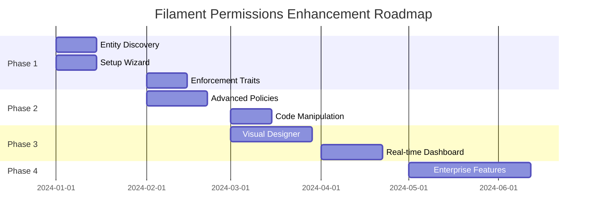

# Future: Implementation Roadmap

> **Phased delivery plan for enhanced features**

## Timeline Overview

## Phase 1: Shield Parity (4 weeks)

**Goal:** Match all Shield features while maintaining our advanced architecture.

### Week 1-2: Entity Discovery

| Task | Priority | Effort | Dependencies |
|------|----------|--------|--------------|
| `EntityDiscoveryService` | High | 3d | None |
| Resource transformer | High | 2d | EntityDiscoveryService |
| Page/Widget transformers | High | 1d | EntityDiscoveryService |
| Discovery caching | Medium | 1d | EntityDiscoveryService |
| `permissions:discover` command | High | 2d | EntityDiscoveryService |
| Integration with PermissionRegistry | High | 1d | Discovery, Registry |

**Deliverables:**
- [ ] `EntityDiscoveryService` with caching
- [ ] Resource/Page/Widget transformers
- [ ] `permissions:discover` CLI command
- [ ] Tests for discovery service

### Week 2-3: Setup Wizard

| Task | Priority | Effort | Dependencies |
|------|----------|--------|--------------|
| `permissions:setup` command | High | 3d | Discovery |
| Environment detection | High | 1d | None |
| Interactive configuration | High | 2d | None |
| Super admin creation | High | 1d | None |
| Policy generation integration | Medium | 1d | Policy generator |
| Verification step | Medium | 1d | All previous |

**Deliverables:**
- [ ] Interactive `permissions:setup` wizard
- [ ] Non-interactive `--minimal` mode
- [ ] Environment detection and validation
- [ ] Tests for setup command

### Week 3-4: Enforcement Traits

| Task | Priority | Effort | Dependencies |
|------|----------|--------|--------------|
| `HasPagePermissions` trait | High | 2d | None |
| `HasWidgetPermissions` trait | High | 1d | None |
| `HasResourcePermissions` trait | High | 2d | None |
| `HasPanelPermissions` trait | High | 1d | None |
| Team/owner scope support | Medium | 2d | Existing services |
| Audit logging integration | Low | 1d | Traits |

**Deliverables:**
- [ ] Four enforcement traits with full features
- [ ] Documentation for trait usage
- [ ] Tests for all traits

---

## Phase 2: Advanced Features (4 weeks)

**Goal:** Enhance policy and code generation capabilities.

### Week 5-6: Advanced Policy Generator

| Task | Priority | Effort | Dependencies |
|------|----------|--------|--------------|
| Policy type enum | High | 0.5d | None |
| Policy stubs (6 types) | High | 2d | Enum |
| Method stubs | High | 1d | Policy stubs |
| `PolicyGeneratorService` | High | 3d | Stubs |
| `permissions:policies` command | High | 2d | Generator |
| Interactive mode | Medium | 1d | Command |
| Dry-run preview | Medium | 1d | Command |

**Deliverables:**
- [ ] 6 policy types with full feature integration
- [ ] `permissions:policies` command
- [ ] Tests for policy generation

### Week 7-8: Code Manipulation Engine

| Task | Priority | Effort | Dependencies |
|------|----------|--------|--------------|
| `CodeManipulator` service | High | 3d | None |
| AST visitors (traits, methods, properties) | High | 3d | CodeManipulator |
| Stringer-compatible API | Medium | 1d | CodeManipulator |
| History/undo support | Medium | 1d | CodeManipulator |
| Diff preview | Medium | 1d | CodeManipulator |
| `permissions:install-trait` command | High | 2d | CodeManipulator |

**Deliverables:**
- [ ] Full code manipulation service
- [ ] CLI for trait installation
- [ ] Tests for all manipulation methods

---

## Phase 3: Visual Tools (6 weeks)

**Goal:** Create visual interfaces for non-technical administrators.

### Week 9-12: Visual Policy Designer

| Task | Priority | Effort | Dependencies |
|------|----------|--------|--------------|
| Policy designer page scaffold | High | 2d | None |
| Condition templates | High | 2d | Page |
| Drag-and-drop conditions | High | 4d | Templates |
| Policy compilation | High | 2d | Conditions |
| Test/simulation panel | High | 2d | Compilation |
| Code export | Medium | 1d | Compilation |
| Policy templates library | Medium | 2d | Designer |
| Blade views | High | 3d | Designer |

**Deliverables:**
- [ ] Fully functional policy designer page
- [ ] 10+ condition templates
- [ ] Policy testing and simulation
- [ ] Policy template library

### Week 13-15: Real-time Dashboard

| Task | Priority | Effort | Dependencies |
|------|----------|--------|--------------|
| Dashboard page scaffold | High | 2d | None |
| Stats widgets | High | 2d | Page |
| Live event stream | High | 3d | WebSocket setup |
| Anomaly detection widget | Medium | 2d | Stats |
| Permission heatmap | Medium | 2d | Stats |
| Filter and search | High | 2d | Stream |
| WebSocket broadcasting | High | 2d | None |

**Deliverables:**
- [ ] Real-time authorization dashboard
- [ ] WebSocket integration
- [ ] Anomaly detection
- [ ] Usage analytics

---

## Phase 4: Enterprise (8 weeks)

**Goal:** Enterprise-grade features for large organizations.

### Week 16-18: Identity Provider Integration

| Task | Priority | Effort | Dependencies |
|------|----------|--------|--------------|
| LDAP sync service | High | 4d | None |
| SAML integration | High | 4d | None |
| Group-to-role mapping | High | 2d | Sync services |
| Scheduled sync | Medium | 1d | Sync services |
| Configuration options | High | 1d | All |

### Week 19-21: Compliance Automation

| Task | Priority | Effort | Dependencies |
|------|----------|--------|--------------|
| SOC2 report generator | High | 3d | None |
| GDPR report generator | High | 2d | None |
| Segregation analysis | High | 2d | None |
| Compliance dashboard widget | Medium | 2d | Reports |
| Report export (PDF/Excel) | Medium | 2d | Reports |

### Week 22-24: Versioning & Workflows

| Task | Priority | Effort | Dependencies |
|------|----------|--------|--------------|
| Permission snapshots | High | 3d | None |
| Snapshot comparison | High | 2d | Snapshots |
| Rollback functionality | High | 2d | Snapshots |
| Approval workflow models | High | 3d | None |
| Approval UI | High | 3d | Models |
| Delegation service | Medium | 3d | None |

**Deliverables:**
- [ ] Full LDAP/SAML integration
- [ ] Compliance reporting suite
- [ ] Permission versioning with rollback
- [ ] Approval workflows
- [ ] Delegation system

---

## Success Criteria

### Phase 1 Exit Criteria
- [ ] All Shield features replicated
- [ ] `permissions:setup` works end-to-end
- [ ] Traits provide drop-in protection
- [ ] 90%+ test coverage

### Phase 2 Exit Criteria
- [ ] 6 policy types generate correctly
- [ ] Code manipulation is AST-safe
- [ ] All tests pass

### Phase 3 Exit Criteria
- [ ] Policy designer is intuitive for non-devs
- [ ] Dashboard provides real-time visibility
- [ ] Performance is acceptable (< 100ms auth checks)

### Phase 4 Exit Criteria
- [ ] LDAP sync works with major providers
- [ ] Compliance reports pass auditor review
- [ ] Enterprise features are production-tested

---

## Risk Assessment

| Risk | Impact | Likelihood | Mitigation |
|------|--------|------------|------------|
| PhpParser breaking changes | High | Low | Pin version, maintain compatibility layer |
| WebSocket complexity | Medium | Medium | Fallback to polling |
| LDAP provider variations | Medium | High | Abstract provider interface |
| Performance at scale | High | Medium | Aggressive caching, query optimization |
| Breaking existing API | High | Low | Semantic versioning, deprecation notices |

---

## Resource Requirements

| Role | Phase 1 | Phase 2 | Phase 3 | Phase 4 |
|------|---------|---------|---------|---------|
| Backend Developer | 1 FT | 1 FT | 1 FT | 2 FT |
| Frontend Developer | 0 | 0.5 | 1 FT | 0.5 |
| QA Engineer | 0.5 | 0.5 | 0.5 | 1 FT |
| Security Review | 0 | 0 | 0 | 1 review |

---

## Documentation Requirements

Each phase should produce:

1. **API Documentation** — All new classes, methods, traits
2. **Usage Guide** — Step-by-step tutorials
3. **Migration Guide** — Upgrading from previous versions
4. **Configuration Reference** — All config options explained
5. **CLI Reference** — All commands with examples
